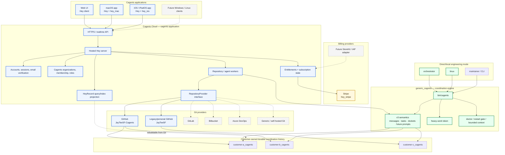
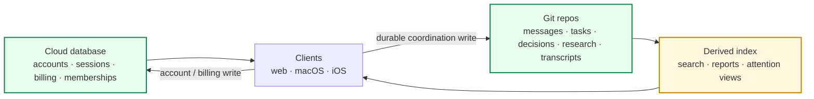

# Cagents architecture — 29 August 2026

This is the editable Mermaid source for the architecture shown in [`cagents.html`](cagents.html).

Status legend used by the accompanying article:

- **Verified:** exercised by the restart/portability gates or otherwise directly accepted.
- **Implemented:** code exists on the current repository path, but production/compiler/distribution acceptance is still pending.
- **Scaffolded:** contract or package shape exists, but the end-to-end behavior is not complete.
- **Remaining:** discussed product requirement that still needs implementation.

## Authority boundaries

The core rule is that **Git remains canonical for durable coordination history**, while cloud account, authentication and billing state are authoritative in the hosted service. Search/index state is derived and must be reconstructable from Git for coordination records.
